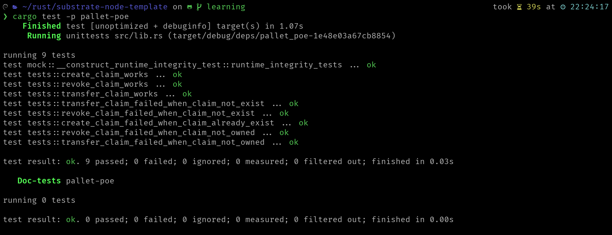
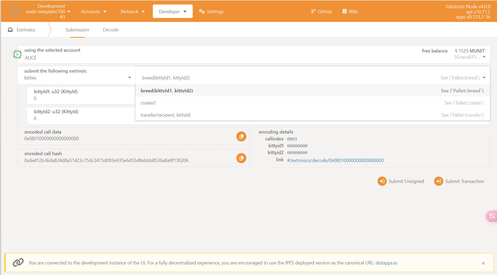

# 进阶课作业

## 作业 1

### 运行截图



### 源码链接

<https://github.com/Hao2203/substrate-learning-template/blob/learning/pallets/poe/src/tests.rs>

## 作业 2

### 运行截图

1. 第 4 题: 
2. 第 5 题: 

### 源码链接

1. 第 4 题: <https://github.com/Hao2203/substrate-learning-template/tree/learning>
2. 第 5 题: <https://github.com/Hao2203/substrate-learning-template/blob/learning/pallets/kitties/src/tests.rs>

## 作业 3

### 运行截图

#### 第 4 题

1. 
2. 

#### 第 5 题


### 源码链接

1. 第 4 题: <https://github.com/Hao2203/substrate-learning-template/tree/learning>
2. 第 5 题: <https://github.com/Hao2203/substrate-learning-template/tree/learning>

## 作业 4

### 问题

1. 请回答链上随机数（如前面 Kitties 示例中）与链下随机数的区别

```sh
链上随机数使用链上信息生成，生成过程公开透明。
链下随机数使在链下环境生成，生成过程不透明。
```

2. 其他问题

助教，最近比较忙，暂时完成不了，我后面一定补上，谢谢助教 😉

## 作业 5

### 第 4 题

#### 源码链接

[链接](/erc20)

#### 运行截图


## 作业 6

### 运行截图


### 源码链接

<https://github.com/Hao2203/substrate-learning-template/tree/learning>
