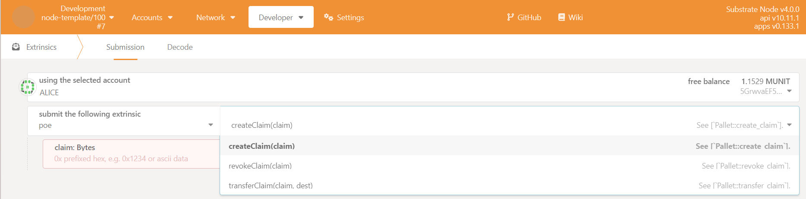
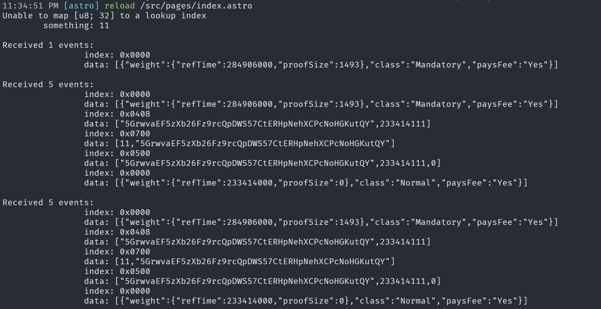

# substrate_learning

用于存放 substrate 学习相关作业

## Bubbel sort

### 代码链接

[链接](/bubble_sort/src/lib.rs)

## 第四课作业

1. [交通灯](/fourth/src/light.rs)
2. [集合求和](/fourth/src/sum.rs)
3. [求面积](fourth/src/area.rs)

## 第五课作业

[8、9 题代码](/pallet/pallet_poe/src/lib.rs)

### 运行截图

## 第六课作业

[代码](/polkadot/src/pages/index.astro)

### 运行截图

